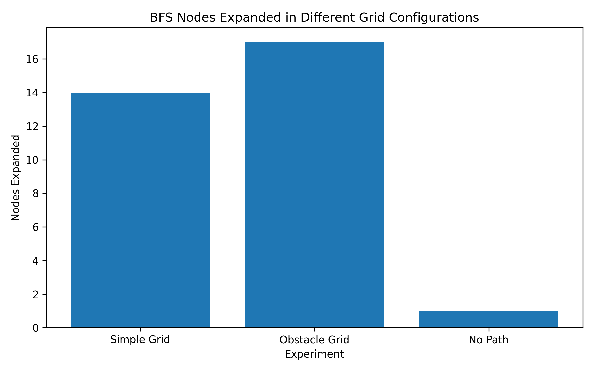

## Experimental Results

| Experiment | Grid Type | Path Found | Path Length | Nodes Expanded | Runtime (seconds) |
|---|---|---|---:|---:|---:|
| 1 | Simple Grid | Yes | 6 | 14 | 0.000081 |
| 2 | Obstacle Grid | Yes | 8 | 17 | 0.000064 |
| 3 | No Path Grid | No | N/A | 1 | 0.000010 |

## Analysis of Results

### Experiment 1 – Simple Grid

BFS successfully found a path from the starting position to the destination.

- Path Length: 6
- Nodes Expanded: 14
- Runtime: 0.000081 seconds

This shows that BFS can efficiently find a path in a relatively simple grid.

### Experiment 2 – Obstacle Grid

BFS successfully navigated through the grid while avoiding obstacles.

- Path Length: 8
- Nodes Expanded: 17
- Runtime: 0.000064 seconds

The presence of obstacles caused BFS to explore a different route before reaching the destination.

### Experiment 3 – No Path

BFS correctly determined that the destination could not be reached.

- Path Found: No
- Nodes Expanded: 1
- Runtime: 0.000010 seconds

This demonstrates that the algorithm can also handle cases where no valid path exists.

## Overall Observation

The experiments show that BFS successfully handles different grid configurations.

The algorithm finds a path when one exists and correctly reports failure when the destination is unreachable.

The measured runtimes are very small for these test cases because the grids are small.
## Visual Analysis

The following graph compares the number of nodes expanded by BFS for the three experimental configurations.

**Figure 3: Comparison of BFS Nodes Expanded**